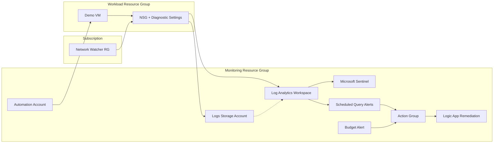

# LayiCorp Azure Monitoring Platform (Landing Zone)

## Overview

This project implements a foundational Azure monitoring and security observability platform using Infrastructure as Code with Azure Bicep.

The goal is to establish a reusable monitoring landing zone that centralizes logs, security signals, and alerting for Azure workloads.  
The design follows real-world platform engineering patterns used by cloud and security teams, with strict separation between configuration and code, environment-based deployments, and scoped resource ownership.

This monitoring platform is designed to **augment existing infrastructure** by providing visibility, not to replace workload deployments.

---

## Core Capabilities

The platform provisions and configures the following:

- Centralized Log Analytics Workspace
- Microsoft Sentinel enablement
- Network security telemetry ingestion
- Regional Network Watcher enablement
- Automation Account with operational runbooks
- Logic App remediation workflow (optional)
- Budget threshold alert for cost awareness (optional)
- Environment-isolated deployments (dev / prod)
- Parameter-driven configuration with no hardcoded environments

---

## Architecture Summary

| Layer | Component | Purpose |
|------|----------|---------|
| Platform | Resource Group | Dedicated monitoring resource isolation |
| Logging | Log Analytics Workspace | Central log and metrics aggregation |
| Security | Microsoft Sentinel | SIEM and security analytics |
| Network | Network Watcher | Enables flow logs and network diagnostics |
| Observability | Diagnostic Settings | Routes platform and network logs to LAW |
| Alerting | Scheduled Query Alerts | Detects security and network anomalies |

---

## Architecture Diagram



---

## Deployment Scope Model

- **Subscription scope**
  - Orchestrates resource groups and cross-RG dependencies
- **Resource Group scope**
  - Log Analytics Workspace
  - Sentinel
  - Diagnostics and alerts
- **Dedicated platform RG**
  - All monitoring resources are isolated from workloads
- **Dedicated NetworkWatcherRG**
  - Regional network watcher resources

This matches how enterprise Azure platform teams structure monitoring foundations.

---

## Repository Structure

```
infra/
    env/
        dev.parameters.json
        prod.parameters.json

    workspace/
        log-analytics.bicep

    sentinel/
        sentinel-enable.bicep

    network-logs/
        network-watcher-enable.bicep
        vnet-flowlogs.bicep

    automation/
        automation-account.bicep
        automation-role-assignment.bicep
        runbooks/

    logicapp/
        remediation.bicep
        remediation-role-assignment.bicep

    compute/
        vm.bicep

    diagnostics/
        diag-nsg.bicep
        diag-firewall.bicep

    alerts/
        log-alerts.bicep
        budget-alert.bicep

kql/
    firewall-denies.kql
    nsg-flows-summary.kql
    suspicious-rdp.kql

.gitignore
README.md
README-setup.md
``` 

- `infra/env/main.bicep` is the **single deployment entry point**
- All environment-specific values are externalized into parameter files
- Modules are deployable independently but intended to be orchestrated via `infra/env/main.bicep`

---

## Environment Configuration

The platform supports multiple environments using separate parameter files.

### Example Environments
- Development
- Production

Each environment deploys to:
- Its own monitoring resource group
- Its own Log Analytics Workspace
- Shared subscription-level capabilities where appropriate

### Parameter Files
- infra/env/dev.parameters.json
- infra/env/prod.parameters.json


No environment values are hardcoded in Bicep templates.

---

## Deployment Process

### Prerequisites
- Azure CLI authenticated to target subscription
- Permissions to deploy subscription-scoped resources
- Bicep CLI installed

### Deploy Development Environment

```
az deployment sub create \
  --name layicorp-monitoring-dev \
  --location westeurope \
  --template-file infra/env/main.bicep \
  --parameters @infra/env/dev.parameters.json
```

### Deploy Production Environment
```
az deployment sub create \
  --name layicorp-monitoring-prod \
  --location westeurope \
  --template-file infra/env/main.bicep \
  --parameters @infra/env/prod.parameters.json
```

## Monitoring and Security Coverage

- Log Sources Ingested

- Network Security Group diagnostics

- Azure Firewall diagnostics

- Network Watcher telemetry

- Security Analytics

- Microsoft Sentinel enabled on the workspace

- KQL queries provided for:

- Firewall deny events

- VNet flow analysis (optional, off by default)

- Suspicious RDP activity

- Alerting

- Scheduled query alerts defined using Bicep

- Alerts optionally integrated with Action Groups

- Alert definitions are environment-agnostic

## Post-Deployment Steps (Operational Readiness)

After a successful deployment, complete the operational steps below to enable automation safely:

1) Assign VM Contributor to the Automation Account (required for shutdown/patch runbooks):

```
az role assignment create \
  --assignee-object-id <automation-principal-id> \
  --assignee-principal-type ServicePrincipal \
  --role "Virtual Machine Contributor" \
  --scope /subscriptions/<subId>/resourceGroups/<workload-rg>
```

If you do not have permissions to create role assignments, keep `assignVmContributor=false` in the parameters and treat this as a manual post-deploy step.

2) Import and schedule runbooks:

```
powershell -ExecutionPolicy Bypass -File infra/automation/import-runbooks.ps1 `
  -AutomationAccountName <automation-account> `
  -AutomationResourceGroup <monitoring-rg> `
  -SubscriptionId <subId> `
  -TargetResourceGroup <workload-rg>
```

3) Tag target VMs so the runbooks act on intended resources:
- `AutoShutdown=true`
- `PatchGroup=prod`

4) Optional: enable Logic App remediation in parameters when a target VM ID is available.

## Cost-Control Defaults

This project ships with cost-conscious defaults. The following settings are disabled unless you explicitly enable them:

- VNet flow logs (`enableVnetFlowLogs=false`)
- Logic App remediation (`enableLogicAppRemediation=false`)
- VM automation permissions are required before runbooks can act on VMs

To keep costs minimal, enable only the features you intend to demo.

## Decisions

### Why Network Watcher Is Managed Separately

Network Watcher is a regional platform dependency.
It is deployed into a dedicated resource group and referenced by downstream telemetry components.

This avoids coupling monitoring logic to workload resource groups.

VM patching is implemented via tagged runbooks using Run Command for demonstration purposes and does not replace enterprise Update Management solutions.

## Evidence and Validation

Screenshots are stored in the `/screenshot` directory and named sequentially to reflect deployment order:

- Baseline provisioning (Network Watcher): `01-baseline-NetworkWatcherRG.PNG`, `02-baseline-NetworkWatcher-resource.PNG`
- Monitoring resource group creation: `03-dev-monitoringRG-overview.PNG`
- Log Analytics workspace: `04-dev-LAW-overview.PNG`
- Automation Account overview + identity: `05-dev-AutomationAccount-overview.PNG`, `06-dev-AutomationAccount-identity.PNG`
- Action Group: `07-dev-ActionGroup-overview.PNG`, `19-dev-ActionGroup-webhook.PNG`
- Runbooks + schedules: `08-dev-Runbooks-list.PNG`, `09-dev-Runbook-Shutdown-code.PNG`, `20-dev-RunbookSchedules-list.PNG`
- VM provisioning + tags + shutdown: `10-dev-VM-overview.PNG`, `11-dev-VM-tags.PNG`, `12-dev-RunbookJob-Shutdown-success.PNG`, `13-dev-VM-powerstate-stopped.PNG`
- Logic App remediation run: `14-dev-LogicApp-overview.PNG`, `15-dev-LogicApp-run-success-1.PNG`, `15-dev-LogicApp-run-success-2.PNG`, `16-dev-VM-restart-activitylog.PNG`
- Budget + log alerting: `17-dev-BudgetAlert-overview.PNG`, `18-dev-LogAlert-rule.PNG`
- Runbook job output: `21-dev-RunbookJob-output.PNG`
- VNet baseline: `22-dev-VNet-overview.PNG`
- Log Analytics query + Sentinel: `23-dev-LogAnalytics-query.PNG`, `24-dev-Sentinel-overview.PNG`

## What This Project Demonstrates

- Subscription-level orchestration using Bicep

- Environment-safe Infrastructure as Code

- Centralized security monitoring architecture

- Realistic platform engineering patterns

- Clean separation of concerns between platform and workloads

This project is intended to reflect how monitoring foundations are built and managed in real Azure environments.

## Future Enhancements

- VNet Traffic Analytics enrichment

- Azure Activity Log diagnostic ingestion

- Incident automation and response workflows

- Role-based access audits and alerting

- Cost optimization monitoring

## Summary

This repository implements a reusable Azure monitoring landing zone that provides centralized visibility, security analytics, and alerting for cloud workloads.

The architecture prioritizes correctness, scalability, and operational realism over unnecessary complexity, making it suitable as both a learning reference and a portfolio-quality platform project.
